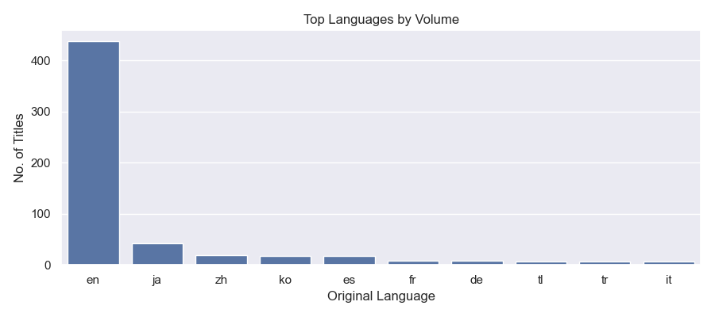

# 🎬 Content Strategy Insights for Streaming

This report analyses recent TMDB ‘popular’ films and television series to reveal **viewer trends**, **language dynamics**, **leading genres**, and **evidence-based recommendations**.

---

## 🔑 Key Findings

- 📈 **Television series** demonstrate steadier or rising average ratings compared with films in recent years.

- 🌍 **en** remains the dominant original language by volume on the ‘popular’ endpoint.

- 💡 Strong recent **sentiment and popularity** observed in: **zh, es, en**.

---

## 🎯 Recommended Focus (Next 12 Months)

| Language   |   Average Popularity |   Average Sentiment |   No. of Titles |
|:-----------|---------------------:|--------------------:|----------------:|
| zh         |              54.0383 |           0.0243093 |              11 |
| es         |              36.8002 |           0.0230595 |              16 |
| en         |              61.3264 |          -0.0169886 |             150 |
| ja         |              86.0252 |          -0.0332503 |              18 |

---

## 🍿 Leading Genres (by Volume)

| Genre              |   No. of Titles |   Average Popularity |   Average Rating |   Average Sentiment |
|:-------------------|----------------:|---------------------:|-----------------:|--------------------:|
| Drama              |             290 |              47.9131 |          7.53365 |          0.0415068  |
| Comedy             |             156 |              44.1872 |          7.26319 |          0.0786605  |
| Crime              |             112 |              56.6908 |          7.63533 |          0.00231669 |
| Action             |             111 |              57.0696 |          7.09678 |         -0.0194932  |
| Animation          |              91 |              47.0447 |          7.88653 |          0.096853   |
| Action & Adventure |              87 |              47.3857 |          8.0266  |          0.0594392  |
| Sci-Fi & Fantasy   |              85 |              52.7815 |          8.11819 |          0.0437991  |
| Mystery            |              83 |              56.3035 |          7.70336 |          0.0162626  |
| Adventure          |              80 |              43.8913 |          7.32986 |          0.048431   |
| Thriller           |              78 |              64.6122 |          6.76031 |         -0.0489325  |
| Fantasy            |              57 |              50.6684 |          7.31796 |          0.0702121  |
| Family             |              56 |              37.0563 |          7.42429 |          0.143506   |
| Romance            |              56 |              33.931  |          6.67402 |          0.139034   |
| Science Fiction    |              48 |              55.5129 |          7.22596 |         -0.0243303  |
| Horror             |              43 |              62.9842 |          6.37214 |         -0.108347   |

---

## 📊 Visual Insights

**Average Ratings Over Time (Films vs Television)**

**Top Languages by Volume**

**Leading Genres by Volume**

**Sentiment versus Popularity (sample)**

---

*Produced with Python (pandas, seaborn, matplotlib, TextBlob) from TMDB data.*
